# **Jarkom-Modul-3-C11-2022**

*Repository* ini berisi laporan resmi dari praktikum modul 3 dari mata kuliah Jaringan Komputer tahun 2022.

</br>

## **Data Diri**
| Nama | Kelas-Kelompok | NRP |
| ------------- | ------------- | ------------- |
| Nur Muhammad Ainul Yaqin | C-11 | 5025201011 |

</br>

## **Laporan Pengerjaan**

Laporan ini berisi penjelasan dari soal-soal yang dikerjakan pada modul 3 hingga masa revisi selesai.

</br>

### **Persiapan**
**Sebelum pengerjaan soal, perlu dibuat topologi dengan konfigurasinya**

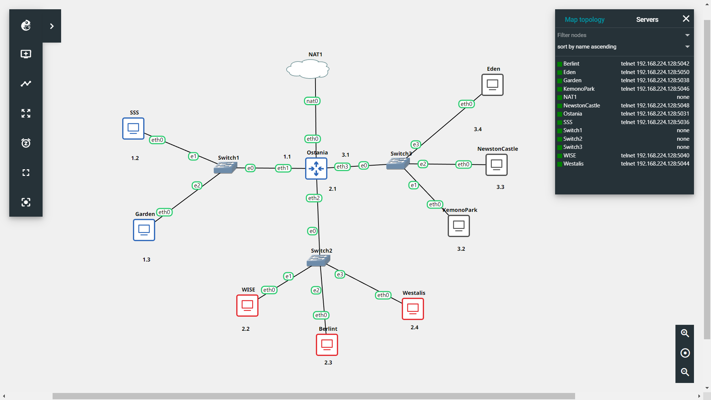

Setelah mengatur susunan topologi, selanjutnya dilakukan beberapa konfigurasi untuk tiap node dan juga router pada setiap port yang digunakan atau tersambung. Awalnya, semua node akan di-assign IP secara manual (static IP)

- **Konfigurasi IP Address**

    Konfigurasi Ostania (Router yang tersambung ke ISP NAT dengan konfigurasi IP dinamis atau DHCP)

    ```bash
    auto eth0
        

    auto eth1
        iface eth1 inet static
        address 10.15.1.1
        netmask 255.255.255.0

    auto eth2
        iface eth2 inet static
        address 10.15.2.1
        netmask 255.255.255.0

    auto eth3
        iface eth3 inet static
        address 10.15.3.1
        netmask 255.255.255.0
    ```

    Konfigurasi SSS (IP Address: 10.15.1.2)

    ```bash
    auto eth0
        iface eth0 inet static
        address 10.15.1.2
        netmask 255.255.255.0
        gateway 10.15.1.1
    ```

    Konfigurasi Garden (IP Address: 10.15.1.3)

    ```bash
    auto eth0
        iface eth0 inet static
        address 10.15.1.3
        netmask 255.255.255.0
        gateway 10.15.1.1
    ```

    Konfigurasi Wise (IP Address: 10.15.2.2)

    ```bash
    auto eth0
        iface eth0 inet static
        address 10.15.2.2
        netmask 255.255.255.0
        gateway 10.15.2.1
    ```

    Konfigurasi Berlint (IP Address: 10.15.2.3)

    ```bash
    auto eth0
        iface eth0 inet static
        address 10.15.2.3
        netmask 255.255.255.0
        gateway 10.15.2.1
    ```

    Konfigurasi Westalis (IP Address: 10.15.2.4)

    ```bash
    auto eth0
        iface eth0 inet static
        address 10.15.2.4
        netmask 255.255.255.0
        gateway 10.15.2.1
    ```

    Konfigurasi KemonoPark (IP Address: 10.15.3.2)

    ```bash
    auto eth0
        iface eth0 inet static
        address 10.15.3.2
        netmask 255.255.255.0
        gateway 10.15.3.1
    ```

    Konfigurasi NewstonCastle (IP Address: 10.15.3.3)

    ```bash
    auto eth0
        iface eth0 inet static
        address 10.15.3.2
        netmask 255.255.255.0
        gateway 10.15.3.1
    ```

    Konfigurasi Eden (IP Address: 10.15.3.4)

    ```bash
    auto eth0
        iface eth0 inet static
        address 10.15.3.2
        netmask 255.255.255.0
        gateway 10.15.3.1
    ```


- Konfigurasi Router (Ostania)

    Agar client bisa terhubung ke internet, perlu dilakukan konfigurasi iptables pada router (Ostania). Kemudian, simpan kedalam file `.bashrc`.

    ```bash
    echo 'iptables -t nat -A POSTROUTING -o eth0 -j MASQUERADE -s 10.15.0.0/16 ' >> .bashrc
    ```

- Konfigurasi Nameserver

    Agar setiap node dapat memiliki koneksi dengan node parent-nya, maka perlu dilakukan konfigurasi nameserver sebagai berikut.

    Untuk node Wise sebagai DNS Master

    ```bash
    echo 'nameserver 192.168.122.1 ' > /etc/resolv.conf
    ```

</br>

### **Soal 1**
**Loid bersama Franky berencana membuat peta tersebut dengan kriteria WISE sebagai DNS Server, Westalis sebagai DHCP Server, Berlint sebagai Proxy Server**

- Pertama, pada Wise dilakukan penginstalan `bind9` untuk menjadi DNS server.

```bash
apt-get update
apt-get install bind9 -y
service bind9 start
```

- Kedua, pada Westalis dilakukan penginstalan `isc-dhcp-server` untuk menjadi DHCP server. Selain itu, juga dilakukan pendaftaran interface untuk menjadi jalan bagi node client untuk terhubung dengan DHCP server. Untuk kasus ini, maka interface tersebut adalah `eth0`. Interface tersebut didaftarkan pada `/etc/default/isc-dhcp-server`.

```bash
apt-get update
apt-get install isc-dhcp-server -y

echo ‘INTERFACES="eth0" ‘ > /etc/default/isc-dhcp-server

service isc-dhcp-server start
```

- Ketiga, pada Berlint dilakukan penginstalan `squid` untuk menjadi proxy server.

```bash
apt-get update
apt-get install squid -y
service squid start

apt-get install php -y
apt-get install apache2 -y
apt-get install libapache2-mod-php7.0 -y
```

Pengetesan dilakukan dengan melakukan pengecekan status dari masing-masing *service* yang telah terpasang.

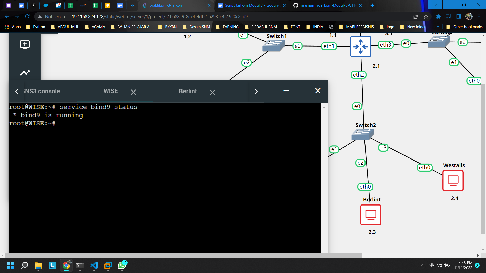

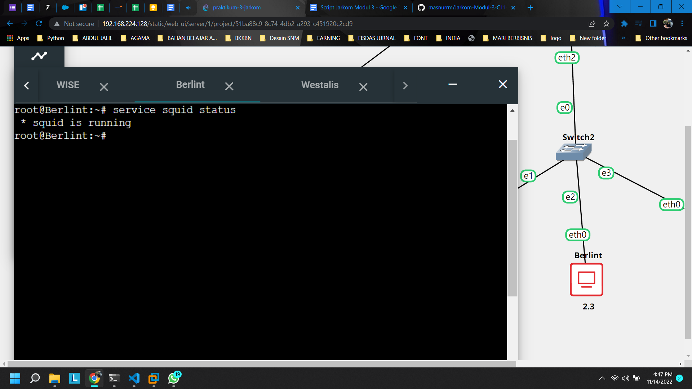

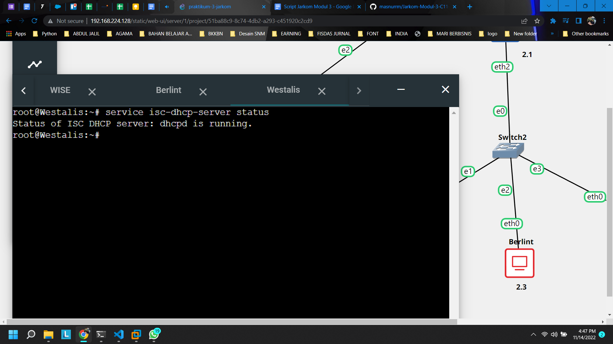

</br>

### **Soal 2**
**Dan, Ostania sebagai DHCP Relay**

Pada Ostania dilakukan penginstalan `isc-dhcp-relay` untuk menjadi DHCP relay dari DHCP server (Westalis).

```bash
apt-get update
apt-get install isc-dhcp-relay -y
service isc-dhcp-relay start
```

Setelah penginstalan, kemudian dilakukan konfigurasi ke mana acuan dari DHCP relay. Dalam kasus ini, acuannya adalah DHCP server, sehingga digunakan IP dari Westalis. Selanjutnya, dilakukan pendaftaran interface dari Ostania yang digunakan untuk menjadi jalan bagi node client untuk terhubung. Sehingga, terdapat tiga interface, yaitu `eth1 eth2 eth3`. Konfigurasi tersabut disimpan pada `etc/default/isc-dhcp-relay`.

```bash
echo ‘SERVERS="10.15.2.4"
INTERFACES="eth1 eth2 eth3"
OPTIONS= ‘ > /etc/default/isc-dhcp-relay
```

Tidak lupa, dilakukan forwarding untuk ipv4 pada `/etc/sysctl.conf`.

```bash
echo ‘net.ipv4.ip_forward=1 ‘ >> /etc/sysctl.conf

service isc-dhcp-relay restart
```

Pengetesan dilakukan dengan melakukan pengecekan status dari masing-masing *service* yang telah terpasang.

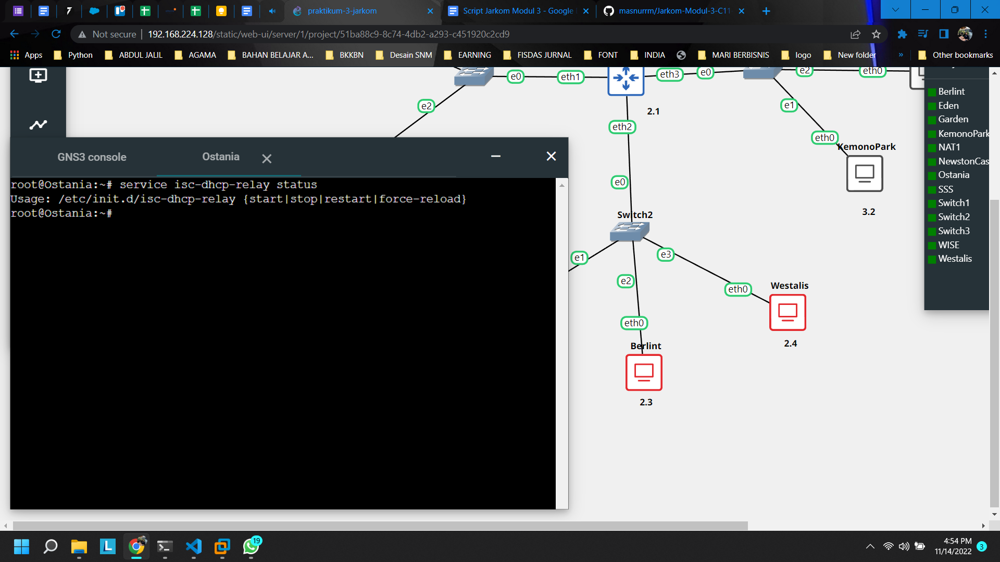


</br>

### **Soal 3, 4, dan 5**
**Loid dan Franky menyusun peta tersebut dengan hati-hati dan teliti.**

**Ada beberapa kriteria yang ingin dibuat oleh Loid dan Franky, yaitu:**
**Semua client yang ada HARUS menggunakan konfigurasi IP dari DHCP Server.**
**Client yang melalui Switch1 mendapatkan range IP dari [prefix IP].1.50 - [prefix IP].1.88 dan [prefix IP].1.120 - [prefix IP].1.155**
**Client yang melalui Switch3 mendapatkan range IP dari [prefix IP].3.10 - [prefix IP].3.30 dan [prefix IP].3.60 - [prefix IP].3.85**

Ketiga soal ini dikerjakan menjadi satu karena sangat saling bergantung satu sama lain.

- Pertama, pada Westalis dilakukan tambahan konfigurasi pada tiap subnet yang menjadi interfacenya di dalam `/etc/dhcp/dhcpd.conf`. Namun, interface di sini adalah interface dari Ostania yang merupakan relay dari DHCP server (Westalis). Sehingga terdapat tiga subnet yang perlu diatur. Hal yang perlu dikonfigurasi adalah range dari subnet, gateway, serta broadcast-nya. Namun, pada subnet kedua tidak ada konfigurasi karena bukan merupakan subnet untuk client dari DHCP.

```bash
echo ‘subnet 10.15.1.0 netmask 255.255.255.0 {
    range 10.15.1.50 10.15.1.88;
    range 10.15.1.120 10.15.1.155;
    option routers 10.15.1.1;
    option broadcast-address 10.15.1.255;
}
subnet 10.15.2.0 netmask 255.255.255.0 {
}
subnet 10.15.3.0 netmask 255.255.255.0 {
    range 10.15.3.10 10.15.3.30;
    range 10.15.3.60 10.15.3.85;
    option routers 10.15.3.1;
    option broadcast-address 10.15.3.255;
} ‘ > /etc/dhcp/dhcpd.conf

service isc-dhcp-server stop
service isc-dhcp-server start
```

- Kedua, pada setiap node client dari DHCP, konfigurasi interface pada `/etc/network/interfaces` yang sebelumnya statis diubah menjadi dhcp agar dapat menerima leasing IP dari DHCP server.

```bash
echo ‘auto eth0
iface eth0 inet dhcp ‘ > /etc/network/interfaces
```

Pengetesan dilakukan dengan melakukan pengecekan pada node client dengan mematikan lalu menyalakannya lagi. Pertama, dilakukan pada node client dengan subnet 10.15.1.0 (Switch 1). Kemudian, dilakukan pada node client dengan subnet 10.15.3.0 (Switch 3)

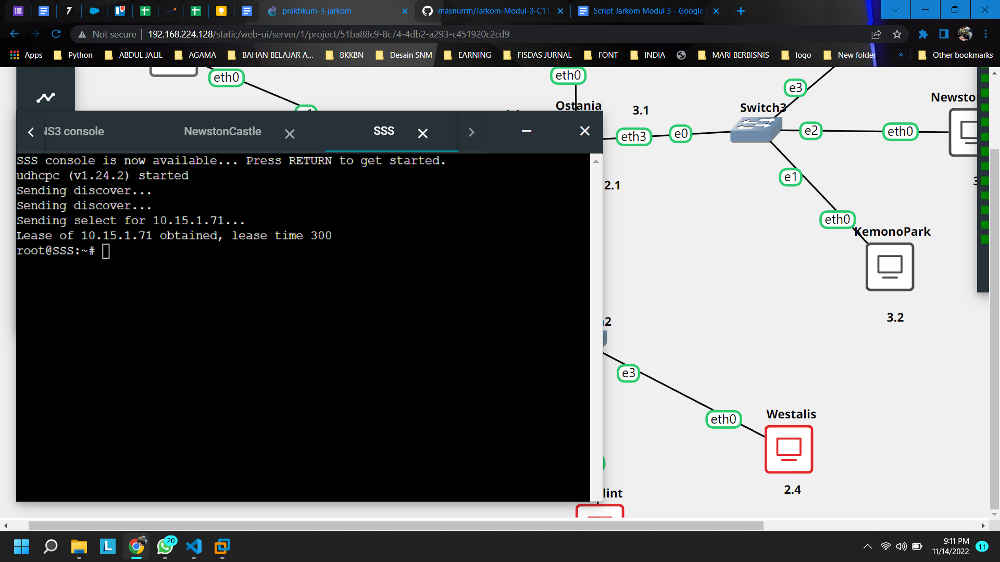

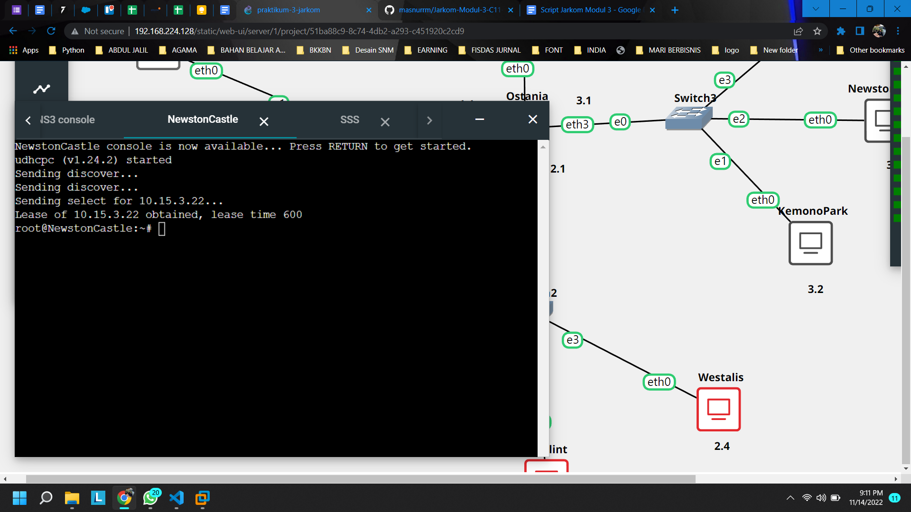

</br>

### **Soal 6**
**Client mendapatkan DNS dari WISE dan client dapat terhubung dengan internet melalui DNS tersebut.**

- Pertama, pada Wise perlu untuk membuat forwarders agar dapat mengakses internet dari Ostania di dalam `/etc/bind/named.conf.options`.

```bash
echo ‘options {
        directory "/var/cache/bind";

        forwarders {
                192.168.122.1;
       };

        // dnssec-validation auto;
        allow-query{any;};
        auth-nxdomain no;    # conform to RFC1035
        listen-on-v6 { any; };
}; ‘ > /etc/bind/named.conf.options
```

- Kedua, pada Westalis, tepatnya pada `/etc/dhcp/dhcpd.conf`, perlu ditambahkan option DNS, di mana dengan itu setiap client yang mengakses akan diarahkan melewati IP dari Wise. Dengan kata lain, nameserver dari setiap client yang terhubung pada DHCP server adalah IP dari Wise.

```bash
echo ‘subnet 10.15.1.0 netmask 255.255.255.0 {
    range 10.15.1.50 10.15.1.88;
    range 10.15.1.120 10.15.1.155;
    option routers 10.15.1.1;
    option broadcast-address 10.15.1.255;
    option domain-name-servers 10.15.2.2;
}
subnet 10.15.2.0 netmask 255.255.255.0 {
}
subnet 10.15.3.0 netmask 255.255.255.0 {
    range 10.15.3.10 10.15.3.30;
    range 10.15.3.60 10.15.3.85;
    option routers 10.15.3.1;
    option broadcast-address 10.15.3.255;
    option domain-name-servers 10.15.2.2;
} ‘ > /etc/dhcp/dhcpd.conf

service isc-dhcp-server stop
service isc-dhcp-server start
```

Pengetesan dilakukan dengan melakukan pengecekan pada node client dengan mematikan lalu menyalakannya lagi. Pertama, dilakukan pada node client dengan subnet 10.15.1.0 (Switch 1). Kemudian, dilakukan pada node client dengan subnet 10.15.3.0 (Switch 3)


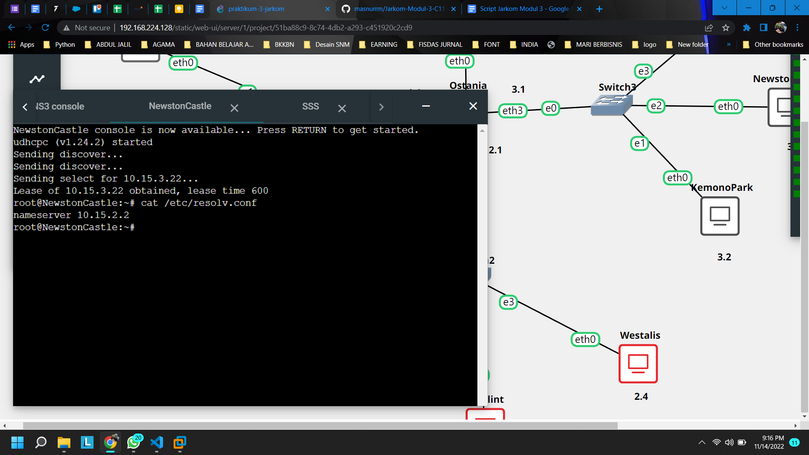

</br>

### **Soal 7**
**Lama waktu DHCP server meminjamkan alamat IP kepada Client yang melalui Switch1 selama 5 menit sedangkan pada client yang melalui Switch3 selama 10 menit. Dengan waktu maksimal yang dialokasikan untuk peminjaman alamat IP selama 115 menit.**

Pada Westalis, tepatnya pada `/etc/dhcp/dhcpd.conf`, perlu ditambahkan konfigurasi untuk mengatur lease time. Terdapat dua konfigurasi, yaitu default-lease-time (lama waktu DHCP server meminjamkan alamat IP kepada client, dalam satuan detik) serta max-lease-time (waktu maksimal yang di alokasikan untuk peminjaman IP oleh DHCP server ke client dalam satuan detik).

```bash
echo ‘subnet 10.15.1.0 netmask 255.255.255.0 {
    range 10.15.1.50 10.15.1.88;
    range 10.15.1.120 10.15.1.155;
    option routers 10.15.1.1;
    option broadcast-address 10.15.1.255;
    option domain-name-servers 10.15.2.2;
    default-lease-time 300;
    max-lease-time 6900;

}
subnet 10.15.2.0 netmask 255.255.255.0 {
}
subnet 10.15.3.0 netmask 255.255.255.0 {
    range 10.15.3.10 10.15.3.30;
    range 10.15.3.60 10.15.3.85;
    option routers 10.15.3.1;
    option broadcast-address 10.15.3.255;
    option domain-name-servers 10.15.2.2;
    default-lease-time 600;
    max-lease-time 6900;

} ‘ > /etc/dhcp/dhcpd.conf

service isc-dhcp-server stop
service isc-dhcp-server start
```

Pengetesan dilakukan dengan menunggu hingga waktu lease time habis. Nantinya, IP dari client akan berganti dengan IP yang baru dalam range yang telah ditentukan.

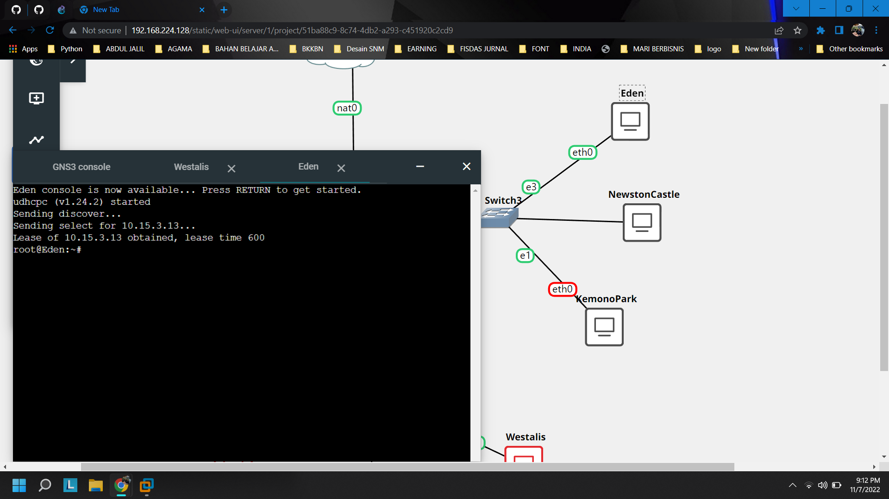


</br>

### **Soal 8**
**Untuk informasi yang lebih spesifik mengenai Operation Strix, buatlah subdomain melalui Berlint dengan akses strix.operation.wise.yyy.com dengan alias www.strix.operation.wise.yyy.com yang mengarah ke Eden**

- Pertama, pada Westalis, tepatnya pada `/etc/dhcp/dhcpd.conf` ditambahkan konfigurasi berikut yang berisi keterangan hardware ethernet dari interface yang mengarah ke DHCP server ataupun relay disertai dengan fixed IP address yang diinginkan. Hardware ethernet ini akan didaftarkan pada DHCP server sehingga DHCP server akan mengetahui interface apa yang memerlukan fixed address.

```bash
host Eden {
    hardware ethernet 5a:4f:c1:11:9f:cd; 
    fixed-address 10.15.3.13;
}

service isc-dhcp-server stop
service isc-dhcp-server start
```

- Kedua, pada Eden (atau client yang lain) dilakukan penambahan konfigurasi pada `/etc/network/interfaces`. Konfigurasi tersebut adalah hardware address dari Eden yang akan dikenalkan dan didaftarkan pada DHCP server. Sebenarnya, hardware address cukup ditambahkan pada konfigurasi client, karena pengajuan dilakukan oleh client. Sehingga, apabila konfigurasi hardware address pada DHCP server dihilangkan, maka fixed address akan tetap berjalan.

```bash
echo ‘auto eth0
iface eth0 inet dhcp
hwaddress ether 5a:4f:c1:11:9f:cd ‘ > /etc/network/interfaces
```

Pengetesan dilakukan dengan melakukan pengecekan pada node client, yaitu Eden. Pengecekan dilakukan dengan mematikan lalu menyalakan lagi untuk mengecek IP yang diperoleh Eden. Selanjutnya, dimatikan lalu dinyalakan lagi. Jika konfigurasi fixed address berhasil, maka Eden akan selalu memperoleh IP yang sama, yaitu 10.15.3.13 sebagai berikut.

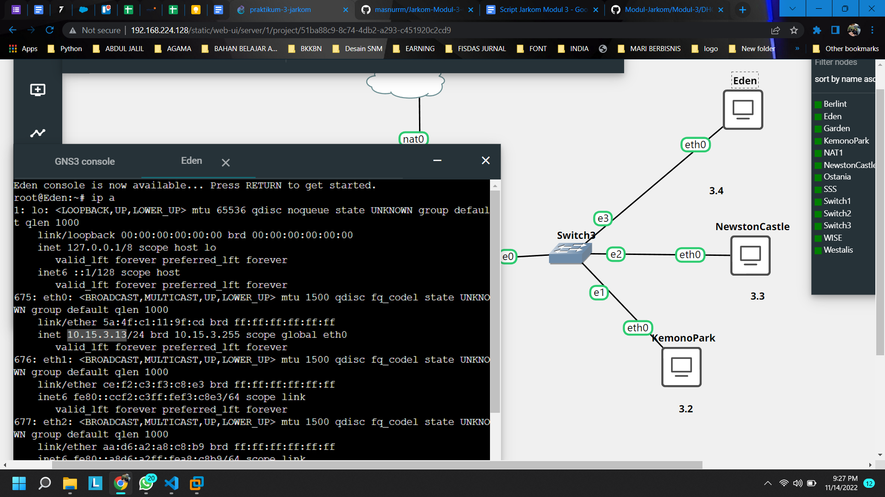


</br>

### **Soal 9**
**SSS digunakan sebagai client Proxy agar pertukaran informasi dapat terjamin keamanannya, juga untuk mencegah kebocoran data. Pada Proxy Server di SSS, Loid berencana untuk mengatur bagaimana Client dapat mengakses internet. Artinya setiap client harus menggunakan SSS sebagai HTTP dan HTTPS proxy.**

- Pertama, pada Berlint perlu dilakukan penambahan konfigurasi port dan hostname pada `/etc/squid/squid.conf`. Pada kasus ini, digunakan port 5000 yang selanjutnya akan menjadi acuan di nomor berikutnya.

```bash
apt-get update
apt-get install squid -y
service squid start

apt-get install php -y
apt-get install apache2 -y
apt-get install libapache2-mod-php7.0 -y

mv /etc/squid/squid.conf /etc/squid/squid.conf.bak

echo ‘http_port 5000
visible_hostname Berlint ‘ > /etc/squid/squid.conf

service squid restart
```

- Kedua, pada SSS (atau client lainnya), dilakukan pengaktifan proxy dengan menggunakan export `http_proxy="http://10.15.2.3:5000"`. Dengan itu, client telah terhubung dengan Proxy server. Selain itu di sini juga dilakukan pemasangan lynx untuk melakukan pengetesan pada nomor-nomor berikutnya.

```bash
export http_proxy="http://10.15.2.3:5000"
apt-get update
apt-get install lynx
```

Pengetesan dilakukan dengan melakukan pengecekan apakah *service* telah berjalan atau belum.

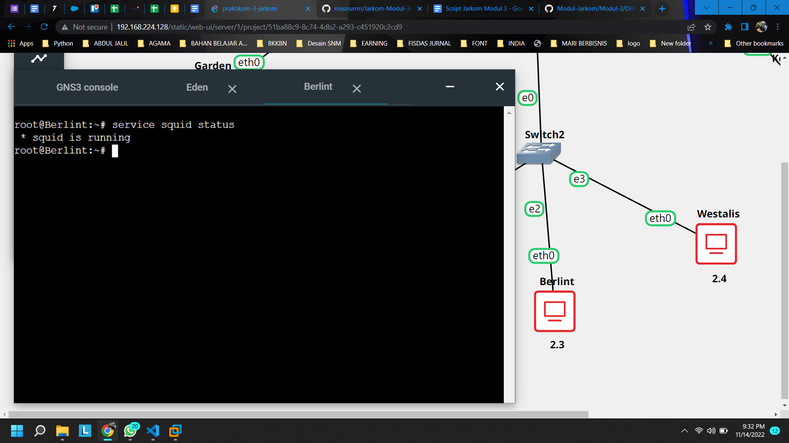


</br>

**Soal mengenai Proxy server akan dilakukan pengecekan di akhir.**

</br>


### **Soal 10**
**Client hanya dapat mengakses internet diluar (selain) hari dan jam kerja (senin-jumat 08.00 - 17.00) dan hari libur (dapat mengakses 24 jam penuh)**

Pada Berlint, dilakukan penambahan acknowledge untuk squid pada `/etc/squid/acl.conf`. Di sini ditambahkan acknowledge berupa jam WORKDAYS dan HOLIDAYS. Acknowledge tersebut selanjutnya digunakan pada konfigurasi squid di `/etc/squid/squid.conf`.

```bash
echo 'nameserver 192.168.122.1 ' > /etc/resolv.conf

apt-get update
apt-get install squid -y
service squid start

apt-get install php -y
apt-get install apache2 -y
apt-get install libapache2-mod-php7.0 -y

mv /etc/squid/squid.conf /etc/squid/squid.conf.bak

echo 'acl WORKDAYS time MTWHF 08:00-17:00
acl HOLIDAYS time AS 00:00-23:59 ' > /etc/squid/acl.conf

echo 'include /etc/squid/acl.conf

http_port 5000
visible_hostname Berlint
http_access allow HOLIDAYS
http_access deny WORKDAYS
http_access allow all ' > /etc/squid/squid.conf

service squid restart
```

</br>

### **Soal 11**
**Adapun pada hari dan jam kerja sesuai nomor sebelumnya, client hanya dapat mengakses domain loid-work.com dan franky-work.com**

- Pertama, pada Wise dilakukan penambahan konfigurasi DNS untuk loid-work.com serta franky-work.com seperti pada modul sebelumnya. 

```bash
# echo ’zone "franky-work.com" {
#	type master;
#	file "/etc/bind/jarkom/franky-work.com";
#}; 
echo ’zone "loid-work.com" {
	type master;
	file "/etc/bind/jarkom/loid-work.com";
}; ’ > /etc/bind/named.conf.local

rm -r /etc/bind/jarkom
mkdir /etc/bind/jarkom

# cp /etc/bind/db.local /etc/bind/jarkom/franky-work.com
cp /etc/bind/db.local /etc/bind/jarkom/loid-work.com

echo ‘;
; BIND data file for local loopback interface
;
$TTL    604800
@       IN      SOA     loid-work.com. root.loid-work.com. (
                              2         ; Serial
                         604800         ; Refresh
                          86400         ; Retry
                        2419200         ; Expire
                         604800 )       ; Negative Cache TTL
;
@       IN      NS      loid-work.com.
@       IN      A       216.239.38.120
@       IN      AAAA    ::1 
www      IN      CNAME   loid-work.com.’ > /etc/bind/jarkom/loid-work.com
```

- Kedua, pada pada Berlint, dilakukan penambahan acknowledge untuk squid pada `/etc/squid/acl.conf`. Di sini ditambahkan acknowledge berupa WHITELIST yang berisikan DNS dari loid-work.com dan franky-work.com. Acknowledge ini ditambahkan beriringan dengan WORKDAYS (operasi AND) pada konfigurasi `/etc/squid/squid.conf`.

```bash
echo 'nameserver 192.168.122.1 ' > /etc/resolv.conf

apt-get update
apt-get install squid -y
service squid start

apt-get install php -y
apt-get install apache2 -y
apt-get install libapache2-mod-php7.0 -y

mv /etc/squid/squid.conf /etc/squid/squid.conf.bak

echo 'acl WORKDAYS time MTWHF 08:00-17:00
acl HOLIDAYS time AS 00:00-23:59
acl WHITELISTS dstdomain loid-work.com franky-work.com  ' > /etc/squid/acl.conf

echo 'include /etc/squid/acl.conf

http_port 5000
visible_hostname Berlint
http_access allow HOLIDAYS
http_access allow WHITELISTS WORKDAYS
http_access deny WORKDAYS
http_access allow all ' > /etc/squid/squid.conf

service squid restart
```

</br>

### **Soal 12**
**Saat akses internet dibuka, client dilarang untuk mengakses web tanpa HTTPS. (Contoh web HTTP: http://example.com)**

Pada Berlint, dilakukan penambahan acknowledge untuk squid pada `/etc/squid/acl.conf`. Di sini ditambahkan acknowledge berupa DISHTTP yang berisikan regex dari suatu string URL yang diawali substring `http://`.  

```bash
echo 'nameserver 192.168.122.1 ' > /etc/resolv.conf

apt-get update
apt-get install squid -y
service squid start

apt-get install php -y
apt-get install apache2 -y
apt-get install libapache2-mod-php7.0 -y

mv /etc/squid/squid.conf /etc/squid/squid.conf.bak

echo 'acl WORKDAYS time MTWHF 08:00-17:00
acl HOLIDAYS time AS 00:00-23:59
acl DISHTTP url_regex ^http:.*$
acl WHITELISTS dstdomain loid-work.com franky-work.com ' > /etc/squid/acl.conf

echo 'include /etc/squid/acl.conf

http_port 5000
visible_hostname Berlint

http_access allow HOLIDAYS
http_access allow WHITELISTS WORKDAYS
http_access deny WORKDAYS
http_access deny DISHTTP 
http_access allow all ' > /etc/squid/squid.conf

service squid restart
```

</br>

### **Soal 13**
**Agar menghemat penggunaan, akses internet dibatasi dengan kecepatan maksimum 128 Kbps pada setiap host (Kbps = kilobit per second; lakukan pengecekan pada tiap host, ketika 2 host akses internet pada saat bersamaan, keduanya mendapatkan speed maksimal yaitu 128 Kbps)**

Pada Berlint, dilakukan penambahan konfigurasi dari `/etc/squid/squid.conf`. Penambahan tersebut terdiri dari beberapa konfigurasi, yaitu delay pools (untuk menampung pool IP yang terhubung dengan Proxy server), delay class (untuk mengatur pilihan coverage dari pengaturan limit bandwidth yang diterapkan), dan delay parameters (untuk mengatur limit bandwidth serta minimal file size agar limit bandwidth berjalan). 

```bash
echo 'nameserver 192.168.122.1 ' > /etc/resolv.conf

apt-get update
apt-get install squid -y
service squid start

apt-get install php -y
apt-get install apache2 -y
apt-get install libapache2-mod-php7.0 -y

mv /etc/squid/squid.conf /etc/squid/squid.conf.bak

echo 'acl WORKDAYS time MTWHF 08:00-17:00
acl HOLIDAYS time AS 00:00-23:59
acl DISHTTP url_regex ^http:.*$
acl WHITELISTS dstdomain loid-work.com franky-work.com

 ' > /etc/squid/acl.conf

echo 'include /etc/squid/acl.conf

http_port 5000
visible_hostname Berlint

http_access allow HOLIDAYS
http_access allow WHITELISTS WORKDAYS
http_access deny WORKDAYS
http_access deny DISHTTP 
http_access allow all

delay_pools 1
delay_class 1 1
delay_parameters 1 16000/16000 ' > /etc/squid/squid.conf

service squid restart
```

Untuk delay pools, dipilih 1 yang berarti semua IP yang terhubung Proxy server saat ini. Untuk delay class, dipilih 1 1 yang berarti semua pools IP tersebut akan diterapkan pengaturan limit bandwidth tanpa satupun client terkecuali. Terakhir, untuk delay parameters dipilih 16000 (dalam byte), yang berarti 16000 * 8 = 128000 (dalam bit).

</br>

### **Soal 14**
**Setelah diterapkan, ternyata peraturan nomor sebelumnya mengganggu produktifitas saat hari kerja, dengan demikian pembatasan kecepatan hanya diberlakukan untuk pengaksesan internet pada hari libur**

Pada Berlint, dilakukan penambahan konfigurasi dari `/etc/squid/squid.conf`, yaitu dengan menambah delay access dengan nilai 1 (berlaku untuk semua pools IP) dengan konfigurasi deny WORKDAYS (konfigurasi tersebut tidak akan diberlakukan pada hari kerja, yang berarti diberlakukan pada hari libur). 

```bash
echo 'nameserver 192.168.122.1 ' > /etc/resolv.conf

apt-get update
apt-get install squid -y
service squid start

apt-get install php -y
apt-get install apache2 -y
apt-get install libapache2-mod-php7.0 -y

mv /etc/squid/squid.conf /etc/squid/squid.conf.bak

echo 'acl WORKDAYS time MTWHF 08:00-17:00
acl HOLIDAYS time AS 00:00-23:59
acl DISHTTP url_regex ^http:.*$
acl WHITELISTS dstdomain loid-work.com franky-work.com

 ' > /etc/squid/acl.conf

echo 'include /etc/squid/acl.conf

http_port 5000
visible_hostname Berlint

http_access allow HOLIDAYS
http_access allow WHITELISTS WORKDAYS
http_access deny WORKDAYS
http_access deny DISHTTP 
http_access allow all

delay_pools 1
delay_class 1 1
delay_access 1 deny WORKDAYS
delay_parameters 1 16000/64000 ' > /etc/squid/squid.conf

service squid restart
```

</br>

**Untuk nomor 9 hingga 14, pengetesan dilakukan dengan menggunakan acuan tabel yang diberikan pada soal sebagai berikut dengan constraint waktu urut yaitu Senin (10.00), Senin (20.00), dan Sabtu (10.00).**

- Akses internet (HTTP) 

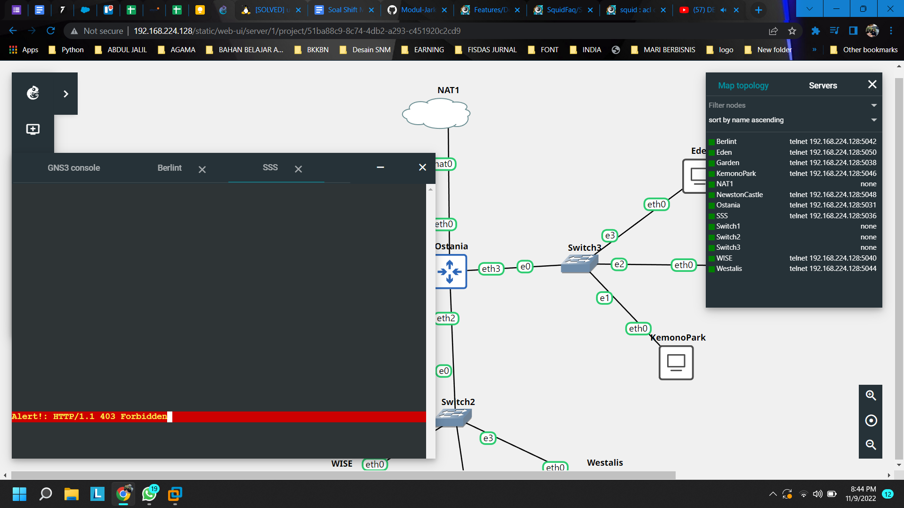


</br>


- Akses internet (HTTPS) 


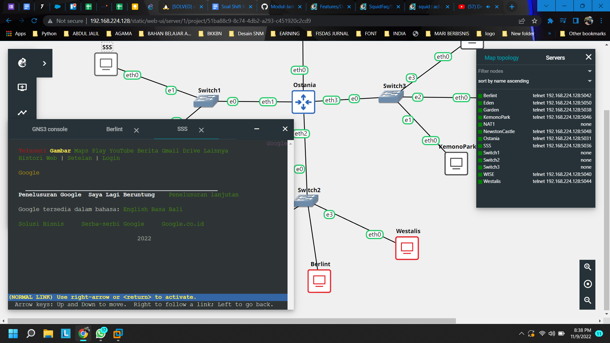

</br>

- Akses loid-work.com dan franky-work.com

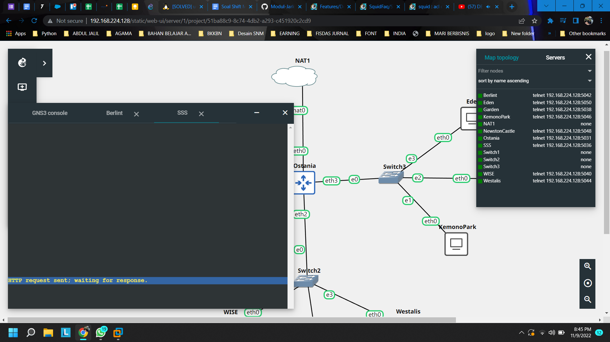


</br>

- Speed limit (128Kbps)


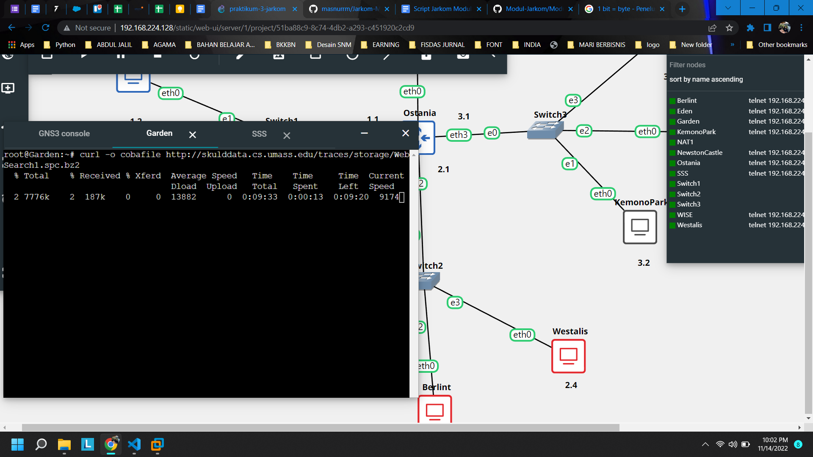


</br>


## **Kendala yang Dihadapi**
Terdapat beberapa kendala saat pengerjaan praktikum, antara lain sebagai berikut.

1. Tantangan dalam manajemen pekerjaan dan waktu, karena dikerjakan sendiri tanpa adanya pembagian task.